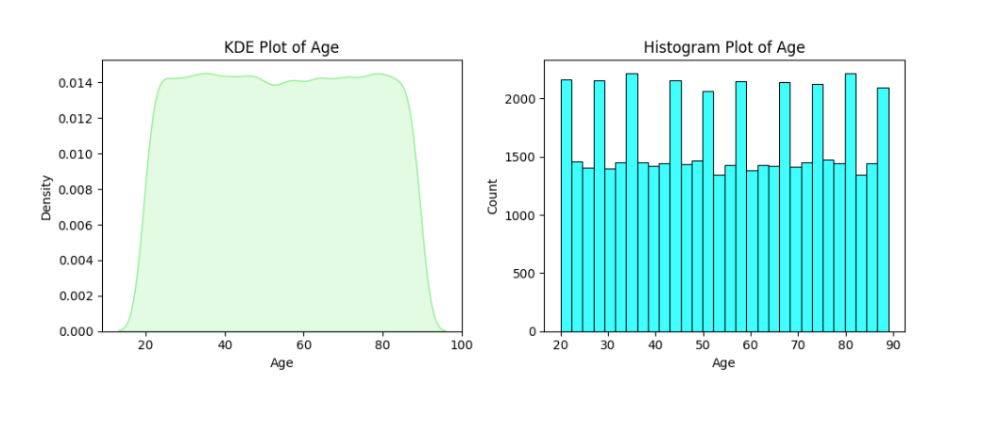
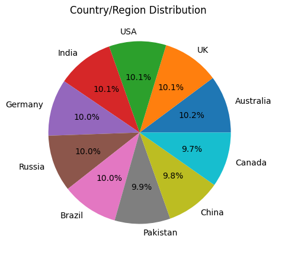
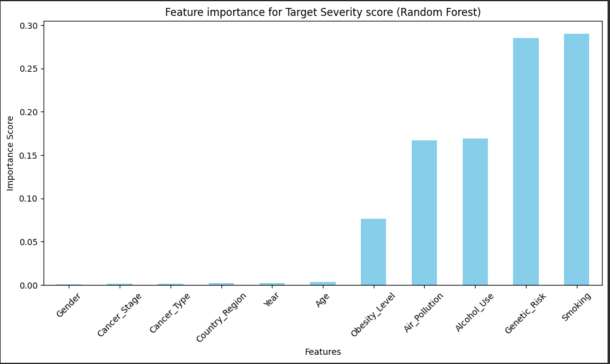
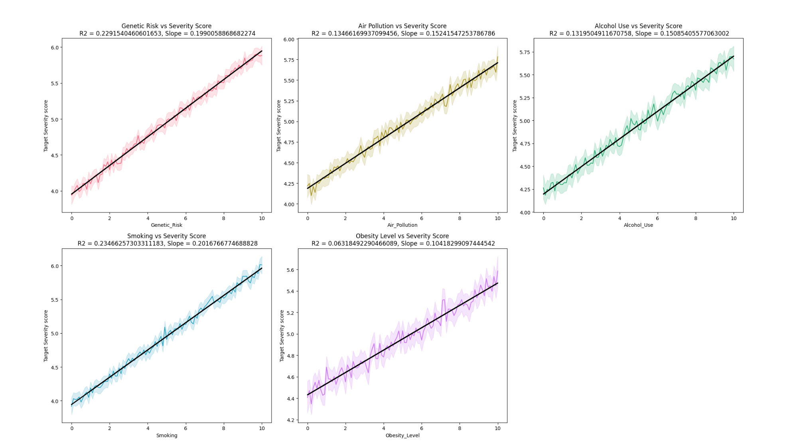
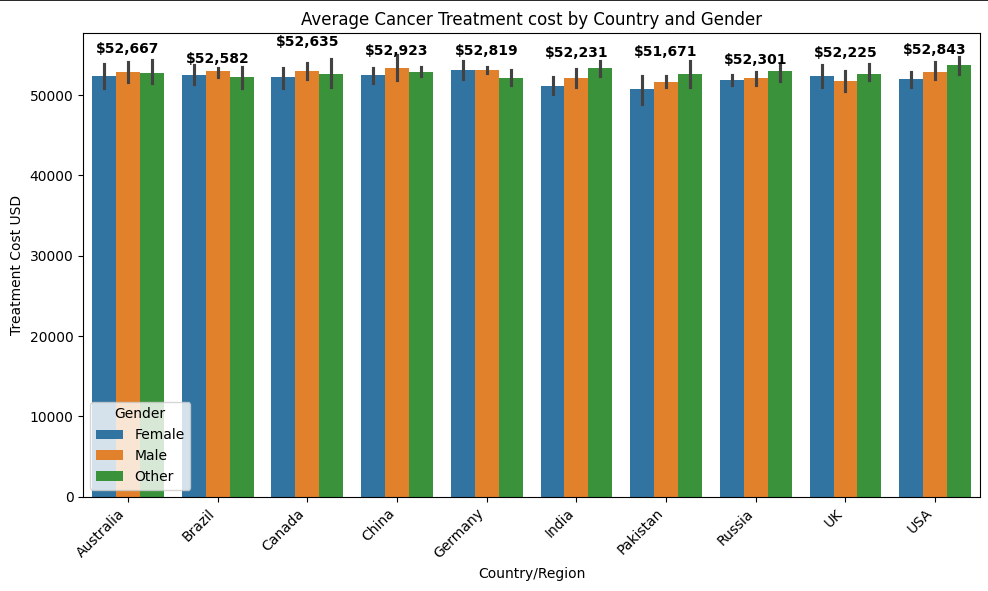
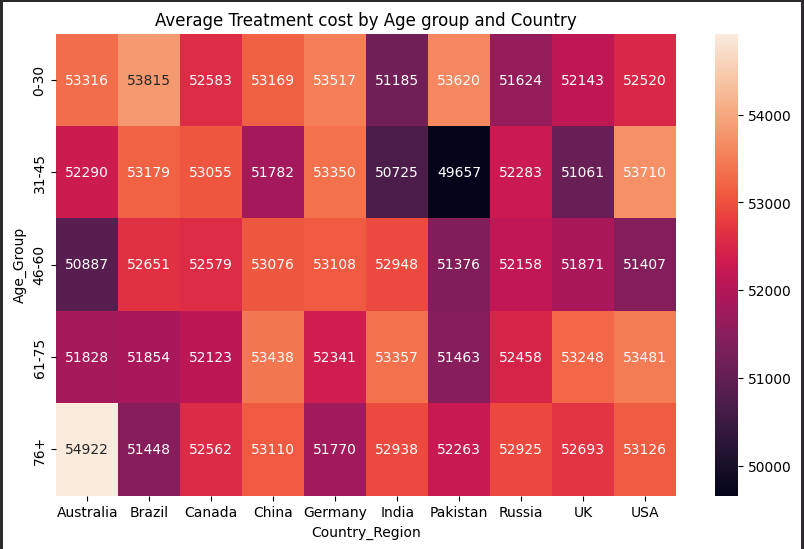

# Global Cancer Patient Data Analysis (2015-2024)

##  Overview

This project presents a comprehensive exploratory data analysis (EDA) of the "Global Cancer Patients 2015-2024" dataset. The analysis aims to uncover relationships between patient demographics, environmental/lifestyle risk factors, and cancer outcomes such as severity, survival years, and treatment costs.

The notebook systematically investigates key questions through descriptive statistics, data visualizations, correlation analysis, and hypothesis testing to derive meaningful insights from the data.

---

##  Dataset

The analysis is based on the `global_cancer_patients_2015_2024.csv` dataset.

-   **Shape:** 50,000 rows × 15 columns
-   **Data Quality:** The dataset is clean, with no missing values or duplicate entries.
-   **Features Include:**
    -   Patient Demographics: `Age`, `Gender`, `Country_Region`
    -   Risk Factors: `Genetic_Risk`, `Air_Pollution`, `Alcohol_Use`, `Smoking`, `Obesity_Level`
    -   Cancer Details: `Cancer_Type`, `Cancer_Stage`
    -   Outcomes: `Treatment_Cost_USD`, `Survival_Years`, `Target_Severity_Score`

---

##  Analysis & Key Questions Explored

This project is structured around answering several key questions:

1.  **Descriptive Analysis**: What is the distribution of key demographic and clinical features like age, gender, country, cancer type, and stage?
2.  **Risk Factor Impact**: What is the relationship between various risk factors and the target cancer severity score?
3.  **Early-Stage Diagnosis**: What is the proportion of early-stage (Stage 0 & I) diagnoses across different cancer types?
4.  **Predictive Modeling**: What are the key predictors of cancer severity and survival years? A Random Forest model is trained to identify feature importances.
5.  **Economic Burden**: How does the financial cost of cancer treatment vary across different demographics (gender, age) and countries?
6.  **Hypothesis Testing**:
    -   Is a higher treatment cost associated with longer survival?
    -   Do higher cancer stages lead to greater costs or reduced survival?
    -   Does genetic risk amplify the negative effects of smoking on cancer severity?

---

##  Key Findings & Visualizations

### 1. Patient Demographics

The dataset shows a remarkably uniform distribution across key demographics.

-   **Age:** The patient age distribution is nearly uniform, ranging from 20 to 89 years, with a mean age of approximately 54. This broad representation supports comparative analysis across different age groups.

    

-   **Gender:** The dataset is well-balanced with nearly equal representation from Male (16,796), Female (16,709), and Other (16,495) genders.

    

-   **Country/Region:** The 50,000 patients are sourced from 10 different countries, with each country contributing a roughly equal share (around 10%) of the total patient population.

    

### 2. Key Predictors of Cancer Severity

-   **Feature Importance:** A Random Forest model reveals that the predictive power for `Target_Severity_Score` is heavily concentrated in lifestyle and inherent risk factors. **Smoking** and **Genetic Risk** are the dominant predictors, each contributing nearly **29%** to the model's importance. Demographics and cancer specifics (like stage or type) have a negligible impact.

    

-   **Correlation with Risk Factors:** All five analyzed risk factors (`Genetic_Risk`, `Air_Pollution`, `Alcohol_Use`, `Smoking`, `Obesity_Level`) show a **positive linear relationship** with the severity score. However, their individual explanatory power is weak, with R² scores ranging from just **6.3%** (Obesity) to **23.4%** (Smoking).

    

-   **Model Performance**: After hyperparameter tuning with `GridSearchCV`, the Random Forest model for predicting `Target_Severity_Score` became more robust, correcting for initial overfitting while maintaining a strong test R² score of **0.767**.

| Metric             | Previous Model (Untuned) | Current Model (Tuned) |
| :----------------- | :----------------------- | :-------------------- |
| **Train R² Score** | `0.9688`                 | `0.8338`              |
| **Test R² Score** | `0.7683`                 | `0.7671`              |

### 3. Economic Burden of Cancer Treatment

-   **Influence of Gender:** Gender has a **minimal to no practical influence** on the average cost of treatment. Within any given country, the cost difference between genders is negligible.

    

-   **Influence of Age and Country:** In contrast, **Age Group** and **Country** reveal more significant variations. The heatmap shows that the **youngest (0-30)** and **oldest (76+)** age groups consistently incur the highest costs. The **31-45 age group is the cheapest** globally, with the lowest average cost found in Pakistan ($49,657) for this demographic.

    

### 4. Survival Years & Cancer Stage Insights

-   **Survival Years**: The `Survival_Years` variable shows **no meaningful correlation** with any of the analyzed features. A Random Forest model trained to predict it achieved an R² score close to zero (0.00019), confirming that the provided features are not predictive of survival duration in this dataset.
-   **Cancer Stage**: ANOVA tests confirmed that `Cancer_Stage` is **not a statistically significant factor** in determining either `Treatment_Cost` (p=0.42) or `Survival_Years` (p=0.60).
-   **Early Diagnosis Rates**: The proportion of early-stage diagnoses (Stage 0 or I) is remarkably consistent across all cancer types, clustering between **38% and 40%**.

---

##  Tools & Libraries Used

This analysis was conducted using Python 3 and the following libraries:
-   **`pandas`**: For data manipulation and analysis.
-   **`numpy`**: For numerical operations.
-   **`matplotlib`** & **`seaborn`**: For data visualization.
-   **`scipy.stats`**: For statistical tests (linear regression, Pearson/Spearman correlation, ANOVA).
-   **`statsmodels`**: For Ordinary Least Squares (OLS) regression to test interaction effects.
-   **`scikit-learn`**: For machine learning, including `RandomForestRegressor`, `GridSearchCV`, and `LabelEncoder`.

---
